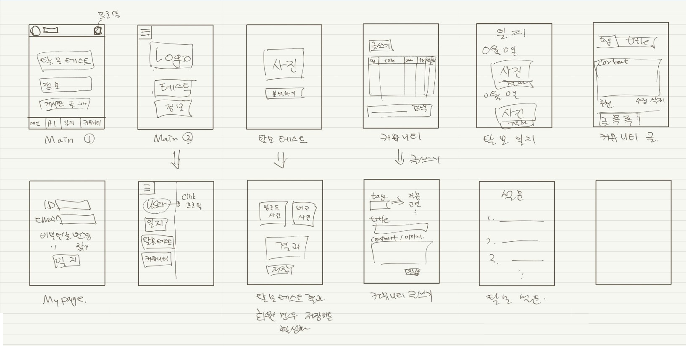

# 자율 프로젝트 - 탈모 테스트(모난 사람)

## 1. 모난사람이란?

<b>모난사람</b> 서비스는 스캔 AI 기술을 이용하여 탈모 진행 상황을 점수로 표현해 주고, 부가적으로 자신이 원하는 사진에 얼굴을 바꿔 합성해주는 서비스를 제공합니다. 더불어 합성된 결과를 게시판에 올려 다른사람과 공유할 수 있는 기능도 있습니다.

### 특징

- 탈모 관련 설문 조사와 AI를 통해 머리의 상태를 점수화 하여 사용자에게 결과를 보기 쉽게 제공
- 점수를 등급으로 변화시켜 간단한 미래의 모습을 제공
- 미리 등록해둔 사진이나 자신이 원하는 헤어스타일의 사진을 기본으로 얼굴 합성기능 제공
- 합성된 결과를 바로 모난사람 커뮤니티에 게시 가능

### 팀원정보

| 이름          | 담당              |
| ------------- | ----------------- |
| 구동엽 (팀장) | 서버 + 백 엔드    |
| 이은재        | AI 개발 + 백 엔드 |
| 박춘화        | 프론트 엔드       |
| 이승헌        | 백 엔드           |
| 이창로        | 프론트 엔드       |

## 2. 모난 사람 정보

### 2-1. 기술 스택


### 2-2. 와이어프레임 및 ERD




### 2-3. 깃 컨벤션

#### 2-3-1. Git-Branch

Git-flow는 다음과 같이 정해져있습니다.

- master : 배포 가능한 상태 브랜치
- develop : 업데이트 할 브랜치 
- feature : 기능을 개발하는 브랜치
  - 기능 별  feature 브랜치의 이름
    - accounts
    - comments
  - ex) back-accounts  // front-accounts

#### 2-3-2. Git-commit

```bash
$ git commit -m "Jira 이슈 번호 | Header | 설명"
```

- JIRA 이슈 번호 or README
- Header
  - Initial : 가장 처음 만든 코드
  - Update : 정상적으로 동작하면서 수정/추가/보완된 코드
  - Fix : 비정상 동작 수정 코드


## 참고

- Face Swap : [https://github.com/matthewearl/faceswap](https://github.com/matthewearl/faceswap)

